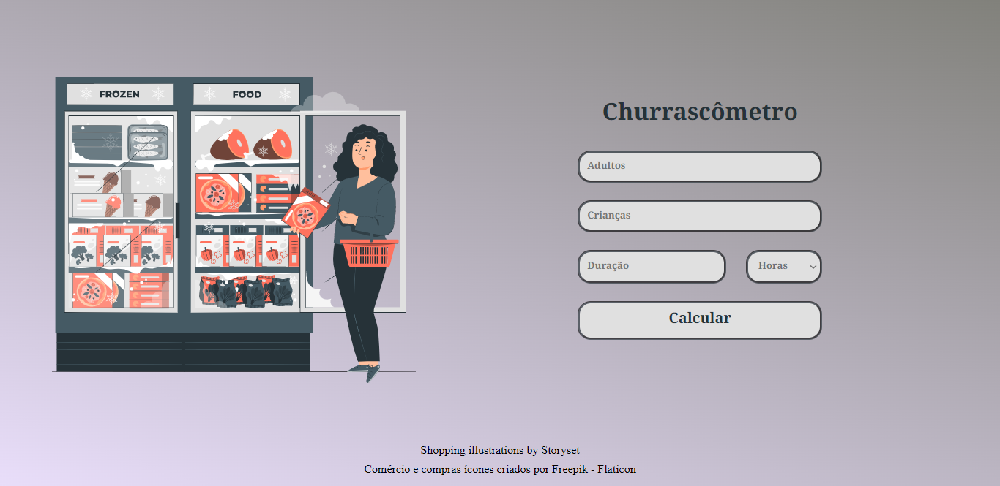

<h1 align="center"> Churrascometro 💻 </h1>

## Briefing 📄

Aplicação web com finalidade de calcular a quantia de carne necessária para um churrasco usando valores genéricos baseados no consumo por pessoa seja ela um adulto ou uma criança.

> [Acessar](https://xurasco.netlify.app)

<h2 align="left"> Objetivo 📌 </h2>

- Melhorar skills como front-end developer

---

<h3 align="center"> Home 📷 </h3>

<h3 align="center"> Tecnologias utilizadas 🤖 </h3>

> 

